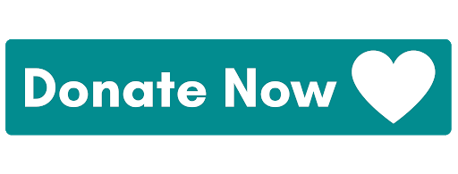

# HelpUs

<h1 align="center">
  
</h1>

# Sobre o Projeto

  Com a iniciativa da ONU e seus parceiros brasileiros trabalhando para alcançar os
Objetivos de Desenvolvimento Sustentável no Brasil, o projeto HelpUs deseja contribuir
com um dos principais pilares necessários para o desenvolvimento nacional, a erradicação
da pobreza. 

  O HelpUs consiste em uma iniciativa para conectar as pessoas que têm o interesse
de auxiliar com aquelas que mais precisam. A ideia é que os doadores e os donatários se
cadastrem no aplicativo e os doadores escolham o projeto/pessoa que desejam colaborar. 

# Status

<h4 align="center"> 🚧 Work in progress . . . 🚧 </h4> 

# Sumário

<!--ts-->
   * [Sobre o projeto](#sobre-o-projeto)
   * [Status](#status)
   * [Sumário](#sumário)
   * [Requisitos Funcionais](#requisitos-funcionais)
   * [Tecnologias Utilizadas](#tecnologias-utilizadas)
   * [Contribuição](#contribuição)
   * [Autores](#autores)
   * [Licença](#licença)
   * [Agradecimentos](#agradecimentos)
<!--te-->

# Requisitos Funcionais

- [x] Cadastrar Usuário
- [x] Fazer Login
- [ ] Cadastrar postagens
- [ ] Visualizar postagens
- [ ] Visualizar perfil
- [ ] Atualizar perfil
- [ ] Editar postagens

# Como testar a API

- Tenha o Sql server instalado
- Caso não tenha o entity framework:
- dotnet tool install --global dotnet-ef --version 5.0.6
- Execute as Migrations na seguinte ordem:
- dotnet ef database update --project HelpUs.Core/HelpUs.Core.csproj
- Executar o projeto
 
# Tecnologias Utilizadas

<h4 align="center"> 🚧 Work in progress . . . 🚧 </h4> 

# Contribuição

Leia o arquivo CONTRIBUTING.md para saber detalhes sobre o nosso código de conduta e o processo de envio de solicitações pull (Pull Request) para nós.

# Autores

<h4 align="center"> 🚧 Work in progress . . . 🚧 </h4> 

# Licença

Este projeto está licenciado sob a Licença MIT, consulte o arquivo LICENSE.md para mais detalhes.

# Agradecimentos

<h4 align="center"> 🚧 Work in progress . . . 🚧 </h4> 
